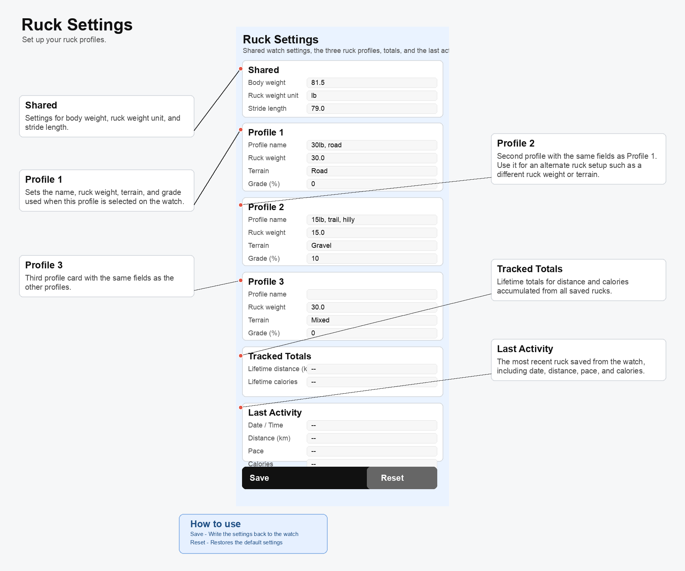

Pebble app which calculates calories expended during a ruck (aka moving quickly with a heavy pack on your back) using a modified version of the Pandolf equation which calculates based on weight, terrain and gradient

The images below explain how to set up and use the app - please raise an issue if you have questions or suggestions for improvement 

## Thanks
* Pandolf equation published by Goruck at https://www.goruck.com/en-gb/pages/rucking-calorie-calculator 
* Display layout heavily inspired by the Garmin Walker data field by wwarby
